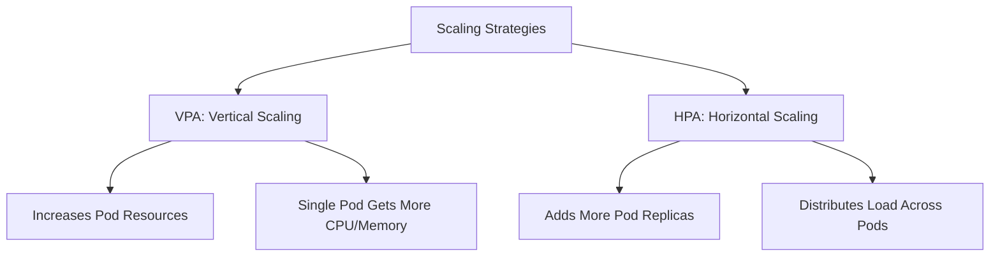
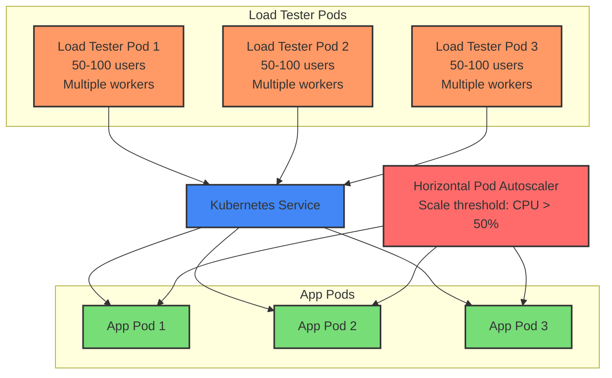
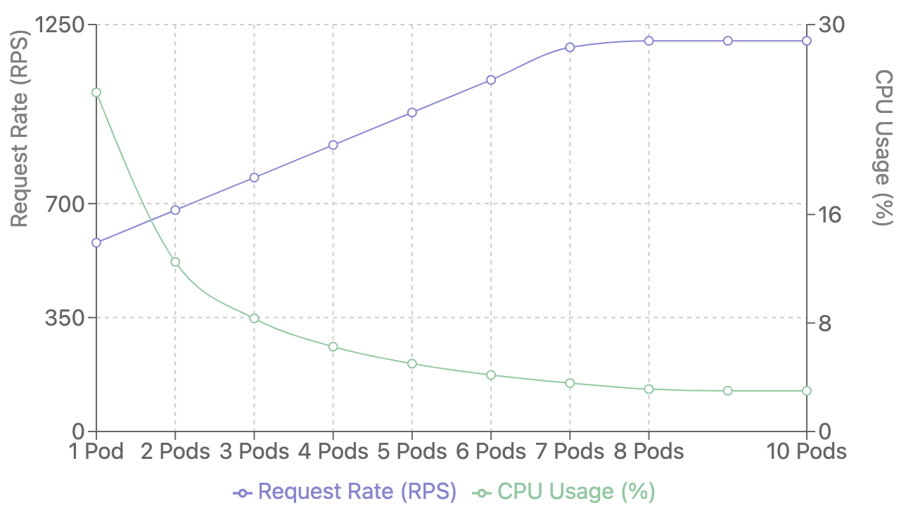
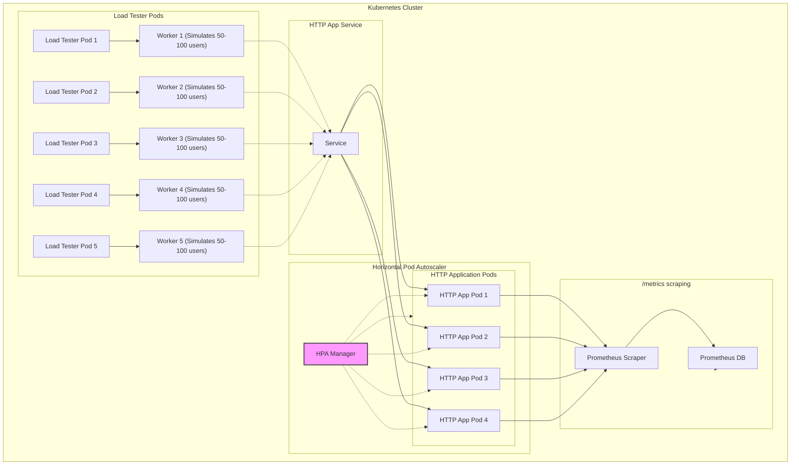
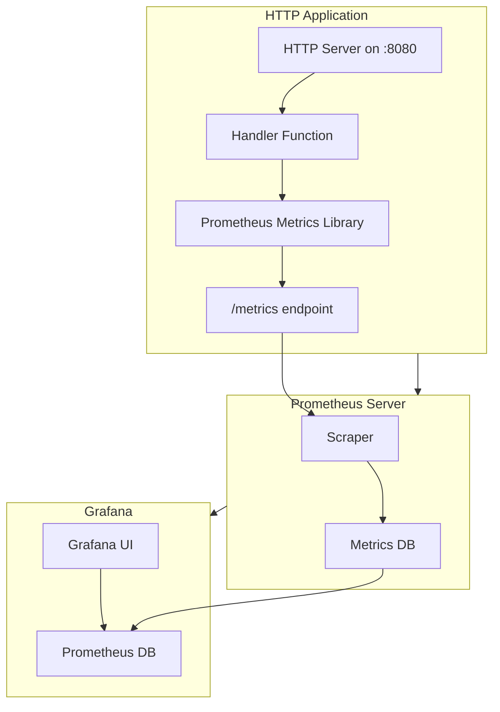
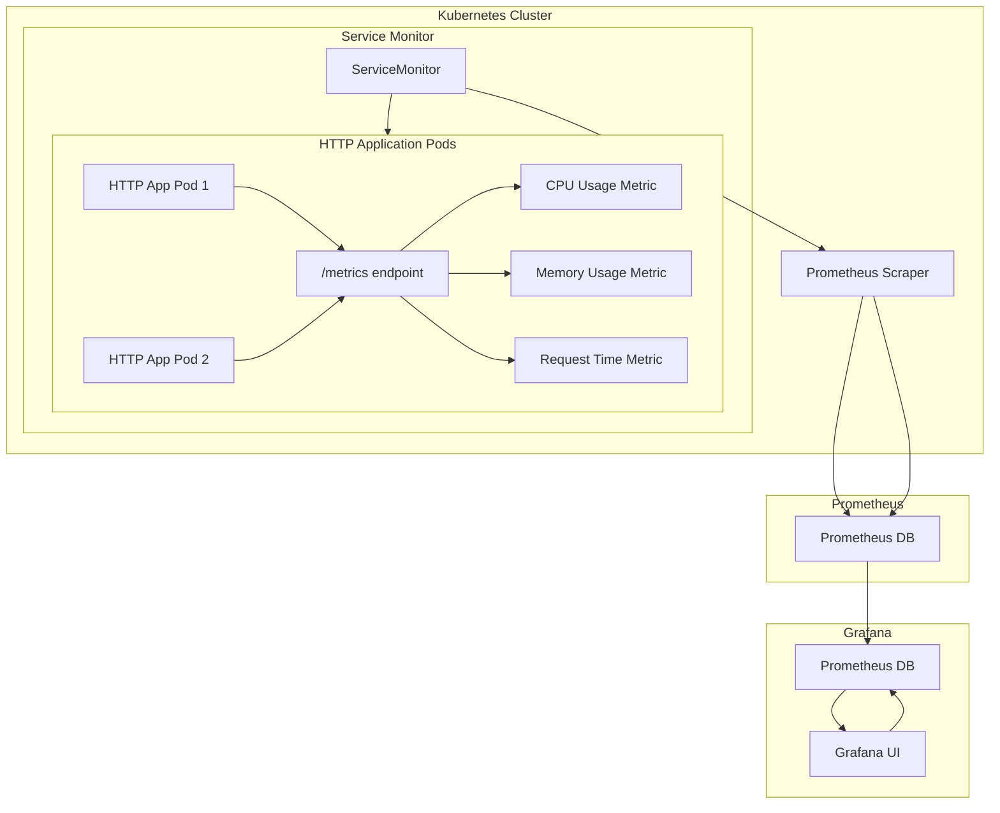

# Analysis of Native Autoscaling in Kubernetes

Overview:
- Running scenarios for HPA and VPA:
    - Stand up app that can take HTTP requests
    - Simulate variable request loads to endpoint with a load tester
    - Simulate raising memory usage in pod
- Observe effects:
    - See how Kubernetes increases and decreases the number of pods, 
    - Timing and windows 
    - Nodes placed on
    - CPU and memory use on the pods and nodes
    - Seeing how Kubernetes changing the pod's resource limits, and changes resourse usage, noticing timing and winodws, nodes placed on, memory usage on the pod and nodes
- Recording metrics: CPU and memory use on pods and across cluster, request rate, endpoint latency, data processed

HPA vs VPA:



## Test Environment

We are using a Kubernetes cluster, developed locally with Kind, and using VMs on Chameleon for scaling up. 


### HPA load testing architecture 




## Observability

- Dashboard of pods on each node used to observe real time behavior: 
https://github.com/learnk8s/k8bit


## To do:

Horizontal Pod Autoscaling scenarios:
1. Set up HTTP-based app so we can load test endpoint and see Kubernetes horizontally scale the pod by increasing and decreasing the number of pods based on load
1. Set up load tester to send request loads: small (to get it to scale down), medium, large (to get it to scale up)
1. Observe and record metrics of resource use in pod and across cluster, how pod count changes and when, request rate and latency as a result

Vertical Pod Autoscaling scenarios:
1. Set up app that requires a lot of resources in the pod, that will need more, setting resource limit
1. Set up load tester/test script to increase the resource use in the pod, making Kubernetes raise the resource limit
1. Observe and record metrics of resource use in pod and across cluster, how the limits change when, data processing rate as a result


## Steps

1. Install Kubernetes cluster (Kind for local, then via Ansible for real nodes)
1. Configure node capacity 
1. Install Kubernetes Metrics Server so things like node and pod resource usage can be gathered with kubectl

HPA
1. Set resource requests and limits for deployment/pod
1. Create HPA on deployment with min/max pods
1. Run `polinux/stress` to [spike CPU to limit in Kubernetes](high-resource-app/stress.yaml)
1. View activity with `kubectl top pods -A`. 
1. View limits on node with `kubectl describe nodes` and:
    ```
    kubectl get nodes -o json | jq '.items[] | {name: .metadata.name, capacity: .status.capacity, allocatable: .status.allocatable}'
    ```
1. Test scenarios:
    - Scale out
    - Scale down
    - Rapid spike in load
    - Gradual increase in load
      Different scraping limits
      Different metrics used
1. Show prometheus and grafana
    - Total requests
    - Request duration
    - Requests per second: `rate(http_requests_total[1m])`
1. Max requests it can get to, and how fast. Tweaks if needed faster. 

## Observations

- 1 pod at 1 pod at 500m CPU and 25Mi Memory.  1 load tester (~200-800 RPS).
    - Requests being sent: 
    - Requests per second:
        - Average 380
        - Peak  758
        - Median 636
    - CPU usage:
        - Average 485m (24.7%)
    - Memory usage:
        - Average: 28Mi (2.3%)
- 2 pods, 10 load testers
    - Requests per second:
        - Average 436
        - Peak  3241
        - Median 711




## Conclusions

Increasing the  number of pods is appropriate when:
- The application can scale horizontally (e.g., stateless apps).
- Requests are distributed across multiple instances.
- Resource limits for a single pod would be exceeded by the load.
- The application is resilient to distributed state.
- Examples:
    - Microservices with variable load
    - Web applications
    - Background processing systems
    - API endpoints

Increasing the resources of a pod is appropriate when:
- The application is stateful or cannot scale horizontally
- The pod's workload is growing, but the number of requests is stable
- Kubernetes detects that resource requests are insufficient for the workload
- Plan fopr cooldown periods to prevent thrashing
- Consider scaling delays
- Configure appropriate thresholds
- Consider potential scaling latency
- Metrics consideration - scarping frequency, accuracy



### Metrics collection archtecture

Here are some diagrams to show how our http-app uses the Prometheus libs to expose metrics at /metrics for Prometheus to scrape them. The endpoint will contain metrics like `http_requests_total` and `http_request_duration_seconds`. It does this via a ServiceMonitor object which Prometheus installed in Kubernetes added. Then Grafana queries Prometheus' database to pull and visualize the data.





**Expected requests per second (RPS) based on different CPU and memory limits for a typical Go web application:**

| CPU Limit | Memory Limit | Expected RPS Range | Typical Use Case | Performance Characteristics |
|-----------|--------------|-------------------|-----------------|----------------------------|
| 100m      | 128Mi        | 50-150 RPS        | Small microservice, lightweight API | Low traffic, dev/staging |
| 250m      | 256Mi        | 150-300 RPS       | Medium complexity service | Moderate web application |
| 500m      | 512Mi        | 300-500 RPS       | High-traffic service | Production web API |
| 1000m (1 core) | 1Gi     | 500-1000 RPS      | Heavy traffic service | High-performance API |
| 2000m (2 cores) | 2Gi     | 1000-2000 RPS     | Enterprise-level service | Mission-critical application |


**Typical CPU Limit Ranges**

| Application Type         | CPU Request (Minimum) | CPU Limit (Maximum) |
|--------------------------|-----------------------|---------------------|
| Static file servers      | 50m                  | 200m                |
| Lightweight REST APIs    | 100m                 | 500m                |
| Medium-complexity APIs   | 200m                 | 1 CPU               |
| High-complexity APIs     | 500m                 | 2-4 CPU             |
| Heavy computational apps | 1 CPU                | 4+ CPU              |

---

### Best Practices
1. Start Small and Scale:
   - Start with conservative limits, e.g., `100m` request and `500m` limit.
   - Monitor performance (latency, CPU usage) under typical and peak traffic.
1. Enable horizontal autoscaling and configure/tune properly
1. Load test
1. Monitor and adjust

### Key Considerations:
  1. Application complexity
  2. Database interactions
  3. External service calls
  4. Concurrency design
  5. Network latency
  6. Specific business logic

### Example Decision Flow
1. Start with a baseline: `200m` request and `1 CPU` limit.
2. Monitor:
   - Is the average CPU usage consistently above 80% of the limit? **Increase the limit.**
   - Is the CPU usage far below the request? **Lower the request or limit.**
3. Test with a real-world traffic simulation.
4. Enable autoscaling if traffic patterns vary significantly. 